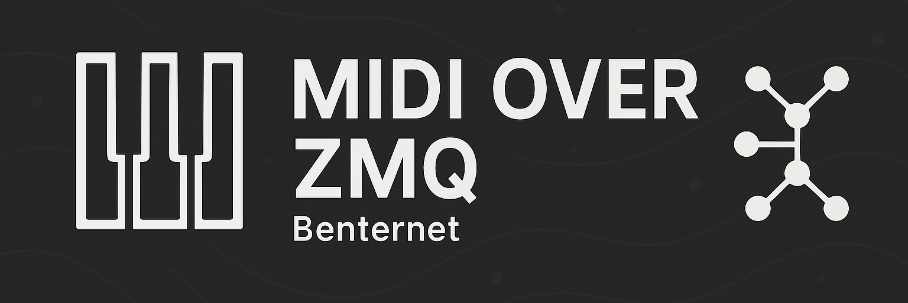

<h1 align="center">
    
</h1>

<h1 align="center">
  <a href="#"> Benternet ZMQ Midi </a>
</h1>

  
  
  

  

<h4 align="center"> 
	 Status: Work In Progress
</h4>

 <a href="#about">About</a> •
 <a href="#To Do">To Do</a> •
 <a href="#how-it-works">How it works</a> • 
 <a href="#tech-stack">Tech Stack</a> •  
 <a href="#author">Author</a> • 
 <a href="#user-content-license">License</a>

## About

PROJECT - This is a project for controlling visuals over a long distance using benternet.

---

## To Do

- [ ] Client midi input
- [ ] Server
  - [ ] Midi handling
  - [ ] Output to resolume (Software for controlling visuals)
- [ ] User interface

---

## How it works

The project consists of two parts:

1. Client
2. Server

The client will take midi input and send the midi signal.
The server will receive the midi signal and process it. It will send the midi signal to a 3th party software that controls visuals for a billboard. The server will also send feedback to the client of wich visual is triggered.

### Pre-requisites

Before you begin, you will need to have the following tools installed on your machine:
- [QtCreator](https://www.qt.io/product/development-tools)
- Software to contoll the visuals, im using [Resolume Arena](https://www.resolume.com)
- ...

## Tech Stack

The following tools were used in the construction of the project:

- **[RT Midi](https://github.com/thestk/rtmidi)**

## Author

<a href="https://www.linkedin.com/in/mauro-de-bruyn-573a8a232/">
 
  
 
<b>Mauro De Bryn</b>
</a>

---
